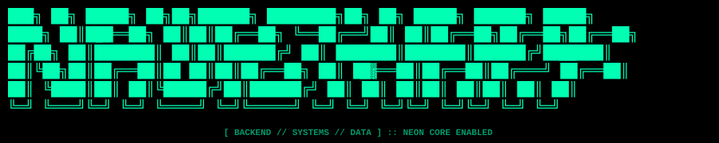
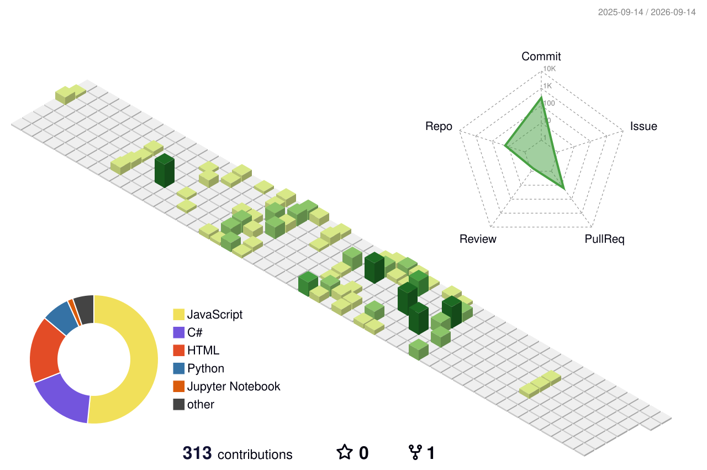

<div align="center">




```diff
+ ╔══════════════════════════════════════════════════════════════════════════════╗
+ ║  MR BIOS (TM)        COPYRIGHT NAJIBTHAPA (C) 2026        VER V2.07          ║
+ ║  SYSTEM ACTIVE       RESEARCH NODE ONLINE                 NEON CORE ENABLED  ║
+ ╚══════════════════════════════════════════════════════════════════════════════╝
!      [ SUMMARY ]    [ FIXED ]    [ BOOT ]    [ SEQ ]    [ MORE+ ]
```


</div>

---

### ⚡ BOOT SEQUENCE

```bash
[ 0.000001 ] BOOT :: NAJIB.SYS V2.07 INITIALIZED
[ 0.000034 ] CHECK :: RAM .................... [  OK  ]
[ 0.000089 ] CHECK :: CPU CORES .............. [  OK  ]
[ 0.000142 ] CHECK :: NEON CORE .............. [ ONLINE ]
[ 0.000201 ] LOAD  :: BACKEND MODULE ......... [ READY ]
[ 0.000287 ] LOAD  :: DATA PIPELINE .......... [ READY ]
[ 0.000356 ] LOAD  :: AUTOMATION ENGINE ...... [ READY ]
[ 0.000412 ] CONNECT :: GITHUB.NAJIBTHAPA1 ... [ LINKED ]
[ 0.000478 ] PING  :: LOCALHOST .............. [  OK  ]
[ 0.000523 ] STATUS :: ALL SYSTEMS OPERATIONAL
[ 0.000601 ] >> WELCOME, OPERATOR.
```

---

```bash
@ECHO OFF
MODE CON: COLS=80 LINES=25
COLOR 0B
```

<table>
<tr>
<td width="55%" valign="top">

```ini
; ─ INITIATING NAJIB.THAPA PROFILE ───────────────
[NAJIB MODULAR BIOS]
version    = V2.07
copyright  = (C) 1999 - 2026  NAJIB.SYS

[IDENTITY]
name       = N A J I B . T H A P A
discipline = BACKEND / SYSTEMS / DATA

[MENU]
1 = SUMMARY
2 = STACK
3 = CONTRIBUTIONS
4 = STATS
5 = NETWORK
6 = EXIT

> ENTER SELECTION (1-6):
> PING LOCALHOST -N 1 ........ OK
> GOTO MENU
```

</td>
<td width="45%" valign="top">

```yaml
[1] SYSTEM SUMMARY:
  name        : NAJIB THAPA
  role        : BACKEND DEVELOPER
  location    : NEPAL
  status      : ONLINE
  speciality  :
    - SYSTEM DESIGN
    - DATA PIPELINES
    - REALTIME APPS

current_work:
  - PYSPARK + POSTGRESQL ETL PIPELINE
  - REALTIME CHAT (REDIS + WEBSOCKETS)
  - AI POWERED CV SHORTLISTING
  - APACHE SUPERSET DASHBOARDS
```

</td>
</tr>
</table>

---

<table>
<tr>
<td width="55%" valign="top">

```css
/* [2] TECH STACK */
.languages   { use: JAVA, PYTHON, JAVASCRIPT, C; }
.backend     { use: NODEJS, EXPRESS, APACHE-TOMCAT; }
.databases   { use: MYSQL, POSTGRESQL, MARIADB, MONGODB; }
.data-tools  { use: PYSPARK, PANDAS, NUMPY, SCIPY; }
.visuals     { use: APACHE-SUPERSET, MATPLOTLIB, PLOTLY; }
.tools       { use: GIT, GITHUB, FIGMA, DOCKER, MAKE.COM; }
```

</td>
<td width="45%" valign="top" align="center">

```diff
+ ░░░░░░░░░░░░░░░░░░░░░
+ ░  N.THAPA / BIOS    ░
+ ░  PORTRAIT MODULE   ░
! ░  STATUS :: ONLINE  ░
+ ░░░░░░░░░░░░░░░░░░░░░
```

</td>
</tr>
</table>

---

```diff
+ ┌──────────────────────────────────────────────────────────────────────────────┐
+ │ [3] CONTRIBUTION MATRIX :: 30-DAY ACTIVITY TRACE                            │
+ ├──────────────────────────────────────────────────────────────────────────────┤
+ │ MODE      ::  RECENT COMMIT TRACE                                           │
+ │ WINDOW    ::  LAST 30 DAYS                                                  │
+ │ AXIS      ::  X = DAYS   |   Y = CONTRIBUTIONS                              │
+ │ SCALE     ::  LOW ░░  MED ▒▒  HIGH ▓▓  PEAK ██                              │
+ └──────────────────────────────────────────────────────────────────────────────┘
```

<div align="center">


</div>

```diff
+ ──────────────────────────────────────────────────────────────────────────────
! >> END OF ACTIVITY TRACE   ::   30-DAY WINDOW RENDERED OK
```

---

```diff
+ ┌──────────────────────────────────────────────────────────────────────────────┐
+ │ [4] GITHUB STATS :: SYSTEM DIAGNOSTICS                                      │
+ └──────────────────────────────────────────────────────────────────────────────┘
```

<div align="center">


</div>

---

```diff
+ ┌──────────────────────────────────────────────────────────────────────────────┐
+ │ 3D CONTRIBUTION MODULE :: NEON CITY RENDER                                  │
+ ├──────────────────────────────────────────────────────────────────────────────┤
! │ MODE      ::  3D ISOMETRIC PROJECTION                                       │
! │ THEME     ::  NEON CORE / DARK MODE                                         │
+ │ RENDER    ::  ANIMATED SVG TOWER GROWTH                                     │
+ │ NODES     ::  YEARLY CONTRIBUTION CELLS                                     │
+ └──────────────────────────────────────────────────────────────────────────────┘
```

```diff
! [ RENDER START ]                                                  [ RENDER END ]
+ ──────────────────────────────────────────────────────────────────────────────
```

<div align="center">



</div>

```diff
+ ──────────────────────────────────────────────────────────────────────────────
! >> 3D RENDER COMPLETE   ::   FRAMES OK
```

---

```yaml
[5] NETWORK LINKS:
  linkedin   : linkedin.com/in/najib-thapa-524015293
  github     : github.com/najibthapa1
  instagram  : instagram.com/____nazib____
  email      : thapanajib@gmail.com

system_message:
  - BUILD CLEAN.
  - AUTOMATE REPETITION.
  - DESIGN FOR SCALE.
  - KEEP SHIPPING.
```

---

<div align="center">

```diff
+ ╔══════════════════════════════════════════════════════════════════════════════╗
! ║   BANK 1 :   [ BUILD ]      [ SHIP ]      [ REFINE ]                         ║
! ║   BANK 2 :   [ LEARN ]      [ AUTOMATE ]  [ REPEAT ]                         ║
+ ╚══════════════════════════════════════════════════════════════════════════════╝
```

```diff
! N  A  J  I  B  .  T  H  A  P  A     //     B I O S   E D I T I O N
```

`(c) najib.sys — all systems operational`

</div>
